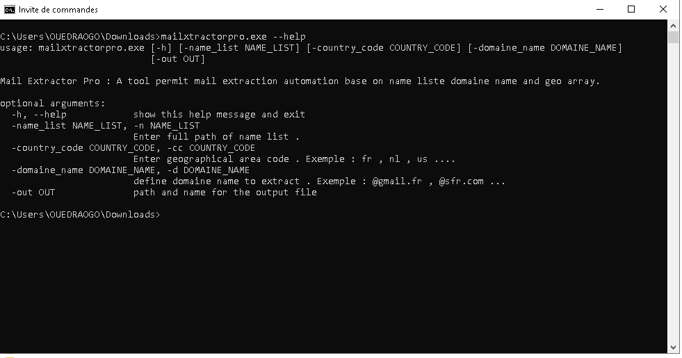
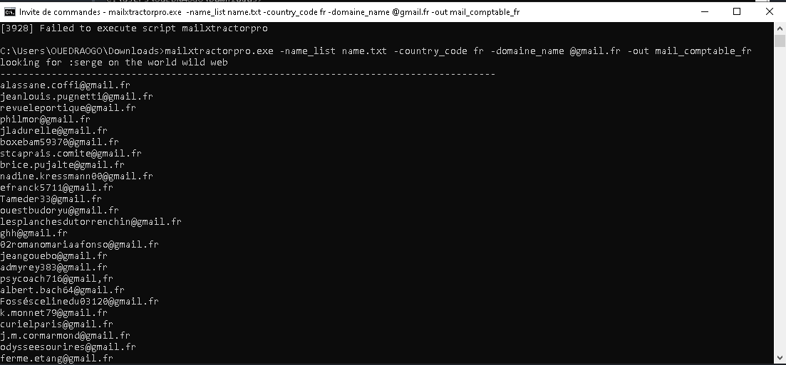

# Mail-Scraper-Pro

As a mail or web marketer, you literally need to collect leads for your large campaign or advertising plan. Most internet mail-based workers use most of the time internet to scrap for mail addresses they can use for Growth prospection. Mail Scraper Pro is a simple easy to use tool for scraping more than 20K mail a simple day depending on your network connection. A friendly command-line tool that even no coder people can use. The software is portable and doesn't need to be installed on your device.  so increase your mail scraping rate now.....

## Welcome to Mail Scraper Pro Project

I start this project in 2020, because on of my friend (Mail marketer) ask me for a way to automatising the process of mail scraping so i start coding this software.It is an open source project,  mean open to any kind or type of contribution  .

## Features

- Importing a wordlist (Afine your search by including comon human name or entreprise specific key word)
- Geospatial Area restriction ( You can specify the country in wich you want your prospect to be )
- Domaine name ( Make a domaine name specific search like @gmail.com or @swisscom.ch )
- Saving the output of the search to a text file

## Installation

First download the mailxtractor.exe file in this repostory
Then lunch windows command line and type the following code 

```sh
cd Downloads
mailxtractorpro.exe --help
```

> You should get this as result :


## Demo

```sh
cd Downloads
mailxtractorpro.exe -name_list name.txt -country_code fr -domaine_name @orange.fr -out mail_comptable_fr
```
> Hope you enjoy using this tool


## Who is this program destined to ?
- Web Marketing Agency ( IT Staf ) 
- Student ( computer science, marketing, Informatic etc ... )
- Teacher
- And anyone who won't lead for mail marketing campaign

I don't incite anyone to use the tool for real life hacking and are not responsible of damage caused by this software. use it at your onw risk.

## Next Step

- Adding project Gui
- Adding filetype designation
- Adding most probable data source


## Buy Me A Coffe
Perfect Money : U289663800 BTC : bc1qxm4e7fr0w9vv73qn4lmnxp4u5ekgndxx33trhk

## Contact info :
email : prof.alex.wolf@gmail.com whatsapp : https://wa.me/+22672587871
